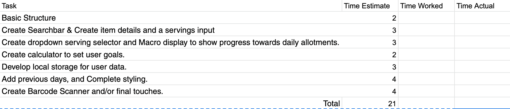

# Simple Macro Tracker

> ###### Brandon Gottshall


**App Description**

In this Application, the user will be able to quickly input items they eat during the day. The nutritionix API will pull nutrition facts for the item and create a display to show the user a simmple visual to track their Macros for the day.

**API**

I will be utilizing the nutritionix API to grab nutrition results for the item added.

This is an Example of a search for almonds within the API.


```
https://api.nutritionix.com/v2/search?q=almonds&limit=10&offset=0

Returns

{
    "exact": false,
    "total": 6914,
    "status": 200,
    "results": [
        {
            "item_name": "Almonds",
            "brand_name": "Blue Diamond Almonds",
            "thumbnail": "https://d1r9wva3zcpswd.cloudfront.net/55be65a5314e839c2e85c489.jpeg",
            "nutrient_name": "Calories",
            "nutrient_value": 160,
            "nutrient_uom": "kcal",
            "serving_qty": 24,
            "serving_uom": "nuts",
            "resource_id": "8ONGs6KeK",
            "nutrients": null
        },
        {
            "item_name": "Almonds",
            "brand_name": "Blue Diamond Almonds",
            "thumbnail": "https://d1r9wva3zcpswd.cloudfront.net/58fda38095fcd6154b0a7a8c.jpeg",
            "nutrient_name": "Calories",
            "nutrient_value": 170,
            "nutrient_uom": "kcal",
            "serving_qty": 28,
            "serving_uom": "nuts",
            "resource_id": "zrWgsbDBJ",
            "nutrients": null
        },
    ]
}
```
**WireFrames**


**MVP**

* Search for food item and add it to day.
* Drop down to select serving size.
* Input field for number of servings.
* Add together all macro nutrients for day and display them in goal bar.
* Add together all calories for day and display them in goal bar.
* Create a calculator to generate goals for user.
* Setup local storage.

**Post MVP**

* Log multiple days to allow user to store their own statistics over time.
* Show the user a dynamic graph based on their macro intakes.
* Add support for instant search from the Nutritionix API
* **Super Bonus** Create barcode scanner.

**Goals**

*Day 1*

Create Proposal and basic structure for application.

*Day 2*

Create search element and have it post into a new element within the current day. Create item details and a servings input to be changed by user.

*Day 3*

Create dropdown serving selector and Macro display to show progress towards daily allotments.

*Day 4*

Create calculator to set user goals.

*Day 5*

Develop local storage for user data.

*Day 6*

Add previous days, and Complete styling.

*Day 7*

Create Barcode Scanner and/or final touches.




**Important Formulas And other neccessary Information**


	Women: BMR = 655 + (4.35 x weight in pounds) + (4.7 x height in inches) - (4.7 x age in years)
	
	Men: BMR = 66 + (6.23 x weight in pounds) + (12.7 x height in inches) - (6.8 x age in years)

	Harris Benedict Formula
	To determine your total daily calorie needs, multiply your BMR by the appropriate activity factor, as follows:
	
	If you are sedentary (little or no exercise) : Calorie-Calculation = BMR x 1.2
	If you are lightly active (light exercise/sports 1-3 days/week) : Calorie-Calculation = BMR x 1.375
	If you are moderatetely active (moderate exercise/sports 3-5 days/week) : Calorie-Calculation = BMR x 1.55
	If you are very active (hard exercise/sports 6-7 days a week) : Calorie-Calculation = BMR x 1.725
	If you are extra active (very hard exercise/sports & physical job or 2x training) : Calorie-Calculation = BMR x 1.9

	Calorie Needs to Lose Weight
	There are approximately 3500 calories in a pound of stored body fat. If you subtract 3500 calories each week through diet, exercise or a combination of both, you will lose one pound of body weight. (On average 75% of this is fat, 25% lean tissue) If you create a 7000 calorie deficit you will lose two pounds and so on. The calorie deficit can be achieved either by calorie reduction alone, or by a combination of eating less and doing more. This combination of healthy eating and physical activity is best for achieving and maintianing a healthy weight.
	
	If you want to lose fat, a useful guideline for lowering your calorie intake is to reduce your calories by at least 500, but not more than 1000 below your maintenance level. For people with only a small amount of weight to lose, 1000 calories is too much. As a guide, the American College of Sports Medicine (ACSM) recommends that calorie levels never drop below 1200 calories per day for women or 1800 calories per day for men. Even these calorie levels are quite low.